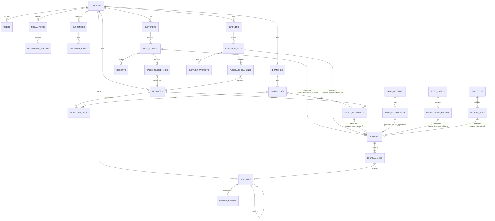

# Accounting ERP — Architecture & Design Document

This document is the pre-implementation blueprint for the system: module dependency map, database schema/ERD, the accounting transaction flow (the core engine), and the Laravel project architecture. No application code is written yet — this is the plan the code will follow.

---

## 1. Module Dependency Map

### 1.1 Layered dependency graph

Modules are grouped into **layers**. A module in a lower layer must exist before anything in a layer above it can function, because higher layers reference lower-layer data (accounts, currencies, tax rules, parties, etc.).

```
Layer 0 — Platform
  Company → Branch → User/Role/Permission → System Settings

Layer 1 — Accounting Foundation
  Fiscal Year & Period → Currency & Exchange Rate → Tax/VAT → Chart of Accounts → Accounting Configuration

Layer 2 — Master Data
  Customer → Supplier → Product/Service → Warehouse

Layer 3 — Accounting Engine (the spine everything else posts to)
  General Journal → Ledger → Opening Balances

Layer 4 — Operational Transactions (each posts into Layer 3)
  Sales (Quotation→Order→Delivery→Invoice→Receipt)
  Purchase (Requisition→Order→GRN→Bill→Payment)
  Inventory (Receive/Issue/Adjust/Transfer)
  Cash & Bank (incl. Bank Reconciliation)
  Expense
  Fixed Assets (incl. Depreciation)
  Payroll

Layer 5 — Derived/Aggregate Modules (read Layer 3 + Layer 4, never store independent truth)
  Accounts Receivable (view over Sales + Journal)
  Accounts Payable (view over Purchase + Journal)
  Budget (compares against Ledger actuals)
  Trial Balance / Financial Statements
  Accounting Reports / Dashboard

Layer 6 — Governance (wraps every layer above)
  Approval Workflow → Audit Trail → Notifications → Documents/Attachments

Layer 7 — Lifecycle Control
  Period Closing → Year End Closing
```

### 1.2 Module → dependency table

| # | Module | Hard dependencies | Phase |
|---|---|---|---|
| 01 | Company | — | 1 |
| 02 | Branch | Company | 1 |
| 03 | User & Role | Company, Branch | 1 |
| 33 | System Settings | Company | 1 |
| 05 | Fiscal Year & Period | Company | 1 |
| 06 | Currency | Company | 1 |
| 07 | Tax/VAT | Company | 2 |
| 08 | Chart of Accounts | Company | 2 |
| 04 | Accounting Configuration | Chart of Accounts, Tax | 2 |
| 09 | Customer | Company, CoA (AR control account), Tax | 3 |
| 10 | Supplier | Company, CoA (AP control account), Tax | 3 |
| 11 | Product/Service | CoA (inventory/sales/purchase/COGS accounts), Tax | 3 |
| 12 | Warehouse | Branch | 3 |
| 20 | General Journal | CoA, Fiscal Period | 4 |
| — | Ledger (derived) | General Journal | 4 |
| — | Opening Balances | CoA, Fiscal Year, Customer/Supplier/Product | 4 |
| 14 | Sales | Customer, Product, Tax, Accounting Config, Journal engine | 5 |
| 15 | Purchase | Supplier, Product, Tax, Accounting Config, Journal engine | 5 |
| 16 | Accounts Receivable | Sales, Journal, Ledger | 5 |
| 17 | Accounts Payable | Purchase, Journal, Ledger | 5 |
| 13 | Inventory | Product, Warehouse, Journal engine | 6 |
| 18 | Cash & Bank | CoA, Journal engine | 6 |
| 19 | Expense | CoA, Cash & Bank, Tax | 6 |
| 21 | Fixed Assets | CoA, Cash & Bank/Payable | 7 |
| 22 | Payroll | Employee data, CoA, Cash & Bank | 7 |
| 23 | Budget | CoA, Branch, Ledger (actuals) | 7 |
| 24 | Accounting Reports | Ledger, all transactional modules | 8 |
| 25 | Financial Statements | Ledger, Fiscal Period | 8 |
| 30 | Dashboard | Reports, Financial Statements | 8 |
| 27 | Approval Workflow | Users/Roles; wraps Sales/Purchase/Journal/Expense/Payroll/Budget | 9 |
| 26 | Audit Trail | Wraps every module | 9 |
| 28 | Notifications | Wraps approval/due-date events | 9 |
| 29 | Documents/Attachments | Wraps transactional records | 9 |
| 31 | Period Closing | Ledger, Financial Statements | 10 |
| 32 | Year End Closing | Period Closing, Fixed Assets (depreciation run), Retained Earnings | 10 |

**Key architectural consequence:** Accounts Receivable, Accounts Payable, Trial Balance, Financial Statements, and Dashboard are **not** modules with their own source-of-truth tables. They are query/report layers over `journal_lines` + subsidiary ledgers. This is what "operational modules feed the accounting system" means in schema terms — duplicating balances into their own tables would violate rule #4/#11/#12/#13 in the data-integrity list.

---

## 2. Database Schema / ERD

### 2.1 Conventions used throughout

- Every tenant-owned table has `company_id` (FK, indexed); branch-scoped tables also carry `branch_id` (nullable where a record is company-wide).
- Every table has `created_by`, `updated_by`, `created_at`, `updated_at`, `deleted_at` (soft delete) unless explicitly a pure log table (audit log is append-only, no soft delete).
- Money columns: `decimal(18,4)` for amounts, `decimal(18,6)` for exchange rates and quantities needing fractional units.
- Every transaction header has a `status` enum column and a `posted_at`/`posted_by` pair, never physically deleted once posted.
- Every document-numbered table has a unique constraint on `(company_id, branch_id, document_number)`.

### 2.2 Entity-relationship diagram (core)



### 2.3 Table-by-table schema (key tables)

**Platform**

- `companies(id, name, legal_name, logo_path, country_code, base_currency_id, tax_registration_no, accounting_basis[accrual|cash], status[active|suspended], settings_json)`
- `branches(id, company_id, code, name, address, manager_user_id, status)`
- `users(id, company_id, name, email, password, is_super_admin, status)`
- `roles(id, company_id nullable, name)` — nullable company_id allows global system roles
- `permissions(id, name, module, action)` — e.g. `sales.invoice.post`
- `role_permissions(role_id, permission_id)`
- `user_roles(user_id, role_id, company_id, branch_id nullable)`
- `user_company_access(user_id, company_id, branch_id nullable)`

**Accounting foundation**

- `fiscal_years(id, company_id, name, start_date, end_date, status[open|closed])`
- `accounting_periods(id, fiscal_year_id, name, start_date, end_date, status[open|closed|locked])`
- `currencies(id, company_id, code, symbol, decimal_places, is_base)`
- `exchange_rates(id, currency_id, rate, effective_date)`
- `tax_types(id, company_id, name)`
- `tax_rates(id, tax_type_id, name, rate_percent, is_inclusive, input_account_id, output_account_id, effective_date)`
- `accounts(id, company_id, code, name, name_bn, type[asset|liability|equity|income|expense], parent_id, level, normal_balance[debit|credit], is_system, is_active)` — indexed unique on `(company_id, code)`; only leaf-level accounts are `postable = true`
- `accounting_settings(id, company_id, default_sales_account_id, default_purchase_account_id, default_inventory_account_id, default_ar_account_id, default_ap_account_id, default_cash_account_id, default_bank_account_id, default_tax_input_account_id, default_tax_output_account_id, voucher_numbering_json)`

**Master data**

- `customers(id, company_id, code, name, email, phone, address, tax_no, credit_limit, payment_terms_days, opening_balance, ar_account_id, is_active)`
- `suppliers(id, company_id, code, name, email, phone, address, tax_no, payment_terms_days, opening_balance, ap_account_id, is_active)`
- `products(id, company_id, sku, name, type[product|service], category_id, unit_id, purchase_price, sales_price, tax_rate_id, inventory_account_id, sales_account_id, purchase_account_id, cogs_account_id, track_inventory, is_active)`
- `warehouses(id, branch_id, code, name, address, manager_user_id, is_active)`

**Accounting engine (the spine)**

- `journals(id, company_id, branch_id, period_id, journal_no, journal_date, source_type[manual|sales_invoice|purchase_bill|receipt|payment|inventory|bank|depreciation|payroll|closing], source_id nullable, reference, description, status[draft|submitted|approved|posted|rejected|reversed|voided], posted_at, posted_by, reversed_journal_id nullable)`
- `journal_lines(id, journal_id, account_id, debit, credit, currency_id, exchange_rate, base_debit, base_credit, party_type[customer|supplier|null], party_id nullable, description)` — **DB-level constraint / application invariant:** `SUM(debit) = SUM(credit)` per `journal_id`, enforced in the posting service inside a DB transaction, checked again by a Postgres/MySQL trigger or a scheduled integrity check.
- `ledger_entries` — **not a stored table**, but a materialized/queryable view (or a denormalized cache table `account_balances_cache(account_id, period_id, opening_balance, debit_total, credit_total, closing_balance)` rebuilt from `journal_lines`, purely for performance). Source of truth remains `journal_lines`.
- `opening_balances(id, company_id, fiscal_year_id, account_id, party_type nullable, party_id nullable, debit, credit)`

**Sales**

- `sales_quotations`, `sales_orders`, `delivery_notes` — header/line pairs mirroring invoice structure, no accounting impact until invoice.
- `sales_invoices(id, company_id, branch_id, customer_id, invoice_no, invoice_date, due_date, currency_id, exchange_rate, subtotal, discount_total, tax_total, grand_total, paid_amount, status[draft|submitted|approved|posted|partially_paid|paid|cancelled|voided], journal_id)`
- `sales_invoice_lines(id, sales_invoice_id, product_id, warehouse_id, quantity, unit_price, discount, tax_rate_id, tax_amount, line_total, cogs_amount)`
- `sales_returns` / `credit_notes` — mirror invoice structure with `original_invoice_id`.
- `receipts(id, company_id, customer_id, receipt_no, receipt_date, cash_or_bank_account_id, amount, journal_id)`
- `receipt_allocations(id, receipt_id, sales_invoice_id, allocated_amount)`

**Purchase** (symmetric to Sales)

- `purchase_requisitions`, `purchase_orders`, `goods_received_notes`
- `purchase_bills(id, company_id, branch_id, supplier_id, bill_no, bill_date, due_date, ..., status, journal_id)`
- `purchase_bill_lines(id, purchase_bill_id, product_id, warehouse_id, quantity, unit_cost, discount, tax_rate_id, tax_amount, line_total)`
- `purchase_returns` / `debit_notes`
- `supplier_payments(id, company_id, supplier_id, payment_no, payment_date, cash_or_bank_account_id, amount, journal_id)`
- `supplier_payment_allocations(id, supplier_payment_id, purchase_bill_id, allocated_amount)`

**Inventory**

- `stock_movements(id, company_id, warehouse_id, product_id, movement_type[opening|receive|issue|adjustment|transfer_in|transfer_out], quantity, unit_cost, valuation_method_snapshot, source_type, source_id, journal_id nullable)`
- `stock_batches(id, product_id, batch_no, expiry_date)` / `stock_serials(id, product_id, serial_no, status)`
- Current stock and stock valuation are **derived** from `stock_movements` (sum by product+warehouse), cached in `inventory_balances_cache` for read performance, same pattern as ledger balances.

**Cash & Bank**

- `bank_accounts(id, company_id, branch_id, account_name, account_no, bank_name, branch_name, currency_id, gl_account_id)`
- `cash_accounts(id, company_id, branch_id, name, gl_account_id)`
- `bank_transactions(id, bank_account_id, type[deposit|withdrawal|transfer|charge|interest], amount, date, journal_id)`
- `bank_statement_imports(id, bank_account_id, file_path, imported_at)`
- `bank_statement_lines(id, import_id, date, description, amount, matched_transaction_id nullable, is_reconciled)`

**Expense**

- `expense_categories(id, company_id, name, expense_account_id)`
- `expenses(id, company_id, branch_id, category_id, payee, expense_date, amount, tax_rate_id, tax_amount, payment_method, cash_or_bank_account_id, status, journal_id, is_recurring, recurrence_rule)`

**Fixed Assets**

- `asset_categories(id, company_id, name, asset_account_id, depreciation_expense_account_id, accumulated_depreciation_account_id, default_method, default_useful_life_months)`
- `fixed_assets(id, company_id, branch_id, category_id, asset_code, name, acquisition_date, acquisition_cost, useful_life_months, method[straight_line|declining_balance], location, status[active|disposed])`
- `depreciation_entries(id, fixed_asset_id, period_id, amount, accumulated_amount, journal_id)`
- `asset_disposals(id, fixed_asset_id, disposal_date, proceeds, gain_loss_amount, journal_id)`

**Payroll**

- `departments`, `designations`, `employees(id, company_id, branch_id, department_id, designation_id, name, join_date, salary_structure_id)`
- `salary_structures(id, basic, allowances_json, deductions_json)`
- `attendance(id, employee_id, date, status)` / `leaves(id, employee_id, type, start_date, end_date, status)`
- `payroll_runs(id, company_id, period_id, run_date, status)`
- `payroll_run_lines(id, payroll_run_id, employee_id, gross_pay, deductions_total, net_pay, journal_id)`

**Budget**

- `budgets(id, company_id, fiscal_year_id, branch_id nullable)`
- `budget_lines(id, budget_id, account_id, period_id, budgeted_amount)`

**Governance**

- `audit_logs(id, company_id, user_id, module, action, record_type, record_id, old_values_json, new_values_json, ip_address, created_at)` — append-only, no `updated_at`/`deleted_at`.
- `approval_workflows(id, company_id, module, min_amount, max_amount, approver_role_id or approver_user_id, sequence)`
- `approval_requests(id, approvable_type, approvable_id, requested_by, status[pending|approved|rejected], current_step, decided_by, decided_at)`
- `notifications` (Laravel's built-in `notifications` table, polymorphic).
- `attachments(id, company_id, attachable_type, attachable_id, file_path, original_name, mime_type, uploaded_by)`

### 2.4 Polymorphism used deliberately (and where it's avoided)

- `journals.source_type/source_id` and `attachments.attachable_type/attachable_id` and `approval_requests.approvable_type/approvable_id` are the only polymorphic relations. This keeps the journal table generic without a `journals` row-per-module explosion.
- Money-bearing balances (AR, AP, stock, cash) are **not** polymorphic tables of their own — they're always derived from `journal_lines`/`stock_movements`, per the "operational modules feed the accounting engine" rule.

---

## 3. Accounting Transaction Flow (the posting engine)

### 3.1 Architecture

```
Operational Transaction (Sales Invoice, Purchase Bill, Payment, Expense, ...)
        │  1. Validate business rules (stock available, credit limit, period open)
        ▼
Accounting Rule Resolver  (maps transaction type + line data → account codes,
                            using Accounting Configuration defaults + product/customer overrides)
        │  2. Build journal draft (one journal per transaction)
        ▼
JournalPostingService::post()
        │  3. Assert SUM(debit) == SUM(credit)          → else abort, throw UnbalancedJournalException
        │  4. Assert accounting period is open            → else abort, throw ClosedPeriodException
        │  5. Assert all accounts are postable leaf nodes  → else abort
        │  6. Wrap in DB transaction:
        │       - insert journals (status=posted, posted_at, posted_by)
        │       - insert journal_lines
        │       - update account_balances_cache (period-level running totals)
        │       - update source document (status=posted, journal_id=...)
        │       - fire JournalPosted event
        ▼
Ledger (query layer over journal_lines)
        ▼
Trial Balance  →  Financial Statements (P&L, Balance Sheet, Cash Flow, Equity)
```

Every operational module calls the **same** `JournalPostingService`; no module writes to `journals`/`journal_lines` directly except through it. This is the mechanism that satisfies "operational modules feed into accounting rather than maintaining separate financial data."

### 3.2 Transaction state machine (shared across Sales, Purchase, Journal, Expense, Payroll, Budget)

```
Draft → Submitted → Pending Approval → Approved → Posted
                 └→ Rejected → Draft (edit & resubmit)

Posted → Reversed   (creates a new opposite journal, both remain visible)
Posted → Voided     (only if reversible without breaking numbering/period rules)
```

Rules enforced by `TransactionStateMachine` (a trait/service shared by all transactional models):

- Only `Draft`/`Rejected` are editable.
- `Posted` is immutable; correction = reversal journal + new corrected transaction, never an in-place edit (data-integrity rule #2).
- Transition to `Posted` is only allowed if `AccountingPeriod.status == open` (rule #3).
- Every transition is written to `audit_logs`.

### 3.3 Worked examples (each = one call into JournalPostingService)

**Sales Invoice (no inventory / service line)**
```
Dr  Accounts Receivable   1,000
    Cr  Sales Revenue              900
    Cr  Tax Payable (Output VAT)   100
```

**Sales Invoice with inventory** — one journal, two source_type groupings but posted atomically:
```
Dr  Accounts Receivable   1,130
    Cr  Sales Revenue              1,000
    Cr  Tax Payable                  130
Dr  Cost of Goods Sold       600
    Cr  Inventory                    600   (COGS = qty × valuation-method unit cost at movement time)
```

**Customer Receipt**
```
Dr  Cash/Bank   1,000
    Cr  Accounts Receivable   1,000
```
(allocated across `sales_invoices` via `receipt_allocations`, oldest-due-first or manual allocation)

**Purchase Bill**
```
Dr  Inventory (or Expense)   1,000
Dr  Input Tax                  100
    Cr  Accounts Payable            1,100
```

**Supplier Payment**
```
Dr  Accounts Payable   1,100
    Cr  Cash/Bank                1,100
```

**Expense**
```
Dr  Expense Account   500
Dr  Input Tax           50
    Cr  Cash/Bank/Payable        550
```

**Depreciation (period-end job)**
```
Dr  Depreciation Expense    833.33
    Cr  Accumulated Depreciation   833.33
```

**Payroll accrual → payment**
```
Dr Salary Expense   50,000
    Cr Salary Payable        50,000
...on payment:
Dr Salary Payable   50,000
    Cr Bank                  50,000
```

**Year-End Closing**
```
Dr  Revenue accounts (close to zero)          X
    Cr  Income Summary                        X
Dr  Income Summary
    Cr  Expense accounts (close to zero)      Y
Dr/Cr Income Summary  →  Cr/Dr Retained Earnings   (Net Profit/Loss)
```

### 3.4 Reconciliation invariants checked continuously (not just at period close)

| Check | Enforced by |
|---|---|
| Trial balance sums to zero | Query: `SUM(debit) - SUM(credit) = 0` across all posted journal_lines in a period |
| AR subledger = GL control account | Query: `SUM(sales_invoices.balance_due)` per customer reconciled against `journal_lines` on the AR account |
| AP subledger = GL control account | Same pattern against AP account |
| Inventory value = GL inventory account | `stock_movements` valuation total vs. `journal_lines` on inventory account |
| Cash/Bank ledger = bank reconciliation | `bank_transactions` vs. `bank_statement_lines.matched_transaction_id` |

These become both automated Pest tests and a "Data Integrity" report administrators can run on demand.

---

## 4. Recommended Laravel Project Architecture

### 4.1 Directory structure (feature-module organized, not type-organized)

```
app/
  Domain/
    Company/            {Models, Actions, Policies}
    Accounting/
      Models/            (Account, FiscalYear, AccountingPeriod, Journal, JournalLine, OpeningBalance)
      Services/          (JournalPostingService, LedgerQueryService, TrialBalanceService,
                           FinancialStatementService, PeriodClosingService, YearEndClosingService)
      Rules/             (AccountingRuleResolver — maps txn type → account codes)
      Events/            (JournalPosted, JournalReversed, PeriodClosed)
      Listeners/         (UpdateAccountBalanceCache, WriteAuditLog)
      Exceptions/        (UnbalancedJournalException, ClosedPeriodException)
    Sales/
      Models/            (SalesInvoice, SalesInvoiceLine, SalesOrder, Quotation, Receipt)
      Services/          (SalesInvoiceService, ReceiptAllocationService)
      Actions/           (PostSalesInvoiceAction, VoidSalesInvoiceAction)
      Http/Controllers, Requests, Resources
    Purchase/            (mirrors Sales)
    Inventory/           (InventoryService, StockValuationService[FIFO/WeightedAverage])
    Party/               (Customer, Supplier — CRM-ish shared concerns)
    Product/
    CashBank/            (BankReconciliationService)
    Expense/
    FixedAsset/          (DepreciationService — Straight Line / Declining Balance)
    Payroll/              (PayrollProcessingService)
    Budget/
    Tax/                 (TaxCalculationService)
    Reporting/           (report-only, read models, exporters)
    Approval/            (ApprovalWorkflowService, polymorphic ApprovalRequest)
    Audit/               (AuditLogger — a listener attached globally via model observers)
    Notification/
    Document/
  Support/
    Concerns/            (BelongsToCompany, HasBranch, HasAuditFields, TransactionStateMachine traits)
    Enums/                (AccountType, TransactionStatus, DepreciationMethod, ...)
    DTOs/                 (JournalLineData, PostingResult, ...)
  Providers/
Database/
  migrations/
  factories/
  seeders/               (ChartOfAccountsSeeder per-country templates, RolePermissionSeeder)
resources/
  js/
    Pages/                (Inertia pages, mirrors Domain modules: Sales/Invoices/Index.vue, etc.)
    Components/           (shared: DataTable, AccountSelector, CustomerSelector, CurrencyInput, ...)
    Composables/          (useCurrency, usePermissions, useAccountingPeriod)
    types/                (TypeScript interfaces mirroring API Resources)
tests/
  Feature/                (per-module, e.g. SalesInvoicePostingTest)
  Unit/                    (AccountingEngine/JournalPostingServiceTest, InventoryValuationTest)
docker/
  php/, nginx/, mysql/
docker-compose.yml
```

### 4.2 Why Domain-first, not MVC-type-first

Grouping by `Domain/Sales`, `Domain/Accounting`, etc. (rather than top-level `Models/`, `Controllers/`, `Services/` folders) keeps every concern of a module together, matches the module dependency map in §1, and makes the accounting engine (`Domain/Accounting`) an explicit, isolated dependency that other domains call into — never the reverse.

### 4.3 Layer responsibilities

| Layer | Responsibility | Rule |
|---|---|---|
| Controller | HTTP/Inertia glue only: validate via Form Request, call one Action/Service, return Inertia response | No business logic, no direct model writes for financial data |
| Form Request | Input validation + authorization gate check | — |
| Policy | "Can this user do X to this record" (company/branch/role scoped) | Checked automatically via `authorizeResource` or explicit `$this->authorize()` |
| Action | One discrete use-case (`PostSalesInvoiceAction`) | Thin orchestration, calls Services |
| Service | Reusable business/accounting logic (`JournalPostingService`, `DepreciationService`) | Framework-agnostic where possible, fully unit-testable |
| Model | Eloquent relationships, scopes (`forCompany()`, `postable()`), casts, and *no* accounting logic | Uses `BelongsToCompany`, `HasAuditFields` traits |
| Event/Listener | Cross-cutting concerns: audit logging, cache invalidation, notifications | Decouples e.g. "journal posted" from "recalculate AR aging cache" |
| Job | Async/period-end work: depreciation runs, payroll runs, recurring journals, report generation | Queued, retried, idempotent |
| Resource | API/Inertia response shaping, currency/number formatting | Single source of "how a Money value renders" |
| Enum | `AccountType`, `TransactionStatus`, `DepreciationMethod` | Native PHP 8.1+ backed enums, not magic strings |
| DTO | Cross-layer data shapes (`JournalLineData`) so Services never accept raw arrays | Enforces the "always balanced journal" contract at the type level |

### 4.4 Cross-cutting mechanisms

- **Company/branch scoping**: global Eloquent scope (`CompanyScope`) applied via a `BelongsToCompany` trait on every tenant model, driven by the authenticated user's active company context (stored in session, validated against `user_company_access`).
- **Audit trail**: Eloquent model `Observer` registered globally on all models using `HasAuditFields`, writing before/after diffs to `audit_logs` inside the same DB transaction as the business write.
- **Approval workflow**: implemented once as a trait (`Approvable`) + polymorphic `approval_requests`, consumed by Sales/Purchase/Journal/Expense/Payroll/Budget models rather than reimplemented per module.
- **Period lock check**: a single `EnsurePeriodIsOpen` rule/service called at the top of `JournalPostingService::post()`, so no module can bypass it.
- **Multi-currency**: every journal line stores both transaction-currency amount and base-currency amount (converted at posting-time rate); exchange gain/loss is posted automatically on settlement via a dedicated `ExchangeGainLossService`.
- **Localization (EN/BN)**: Laravel's built-in localization for UI strings; `accounts.name_bn` and similar `_bn` columns for data that must display in Bangla regardless of UI language.

### 4.5 Testing strategy mapped to architecture

- **Unit tests** target `Domain/*/Services` in isolation (mocked repositories/DB where feasible) — this is where "Debit = Credit", FIFO/weighted-average valuation, and depreciation formulas get their heaviest coverage.
- **Feature tests** drive full HTTP/Inertia flows per module (create invoice → post → assert journal + stock movement + AR balance all changed consistently).
- **Authorization tests** assert Policy denials across role combinations (Viewer cannot post, Accountant cannot access another company).
- **Period-lock tests** assert posting into a closed period always throws `ClosedPeriodException`, for every transaction type, not just Journal.

---

## 5. What this unlocks for implementation

With this document in place, module-by-module implementation (Phase 1 → Phase 10, as already scoped in the brief) can proceed without re-deriving architecture decisions mid-build: every new module's migration follows the conventions in §2.1, every new transaction type calls the one `JournalPostingService` in §3.1, and every new feature folder follows the `Domain/<Module>` shape in §4.1.

Suggested next step: scaffold Phase 1 (Company, Branch, User/Role/Permission, Fiscal Year, Currency, System Settings) — migrations, models, policies, and seeders — since every later module depends on it.
